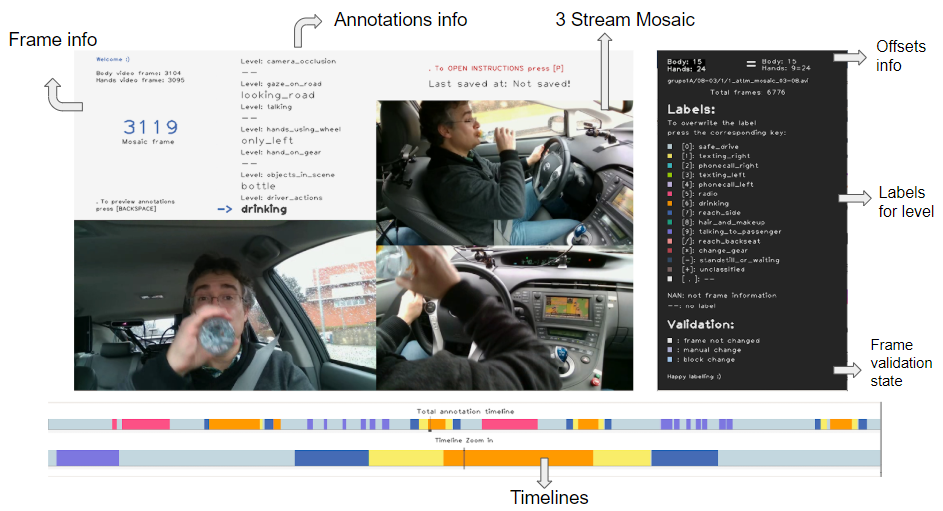

# Temporal Annotation Tool (TaTo)
We have acquired a good amount of high quality and friendly driver’s material in the DMD (Driver Monitoring Dataset) with the purpose of developing computer vision algorithms for driver monitoring. But what would be a dataset without its corresponding annotations? 

We developed the TaTo tool to annotate temporal events and actions performed by the drivers in the video sequences. The tool was used to annotate distraction-related actions. However, through configuration, other labels can be annotated.   

## Content
- [Temporal Annotation Tool (TaTo)](#temporal-annotation-tool-tato)
  - [Content](#content)
  - [Dependencies:](#dependencies)
  - [TaTo characteristics](#tato-characteristics)
  - [Launching TaTo](#launching-tato)
  - [Usage Instructions](#usage-instructions)
    - [TaTo Window description](#tato-window-description)
    - [Annotating with TaTo](#annotating-with-tato)
  - [Saving annotations](#saving-annotations)
  - [Annotation Instructions](#annotation-instructions)
  - [FAQs](#faqs)
  - [License](#license)

## Dependencies:
The TaTo tool has been tested using the following system configuration:

**OS:**           Ubuntu 18.04 (on windows use WSL)  
**Dependencies:** Python 3, OpenCV-Python 4.2.0, VCD 4.2.0                        

For a detailed description on how to configure the running environment check: [Linux](docs/setup_linux.md) / [Windows](docs/setup_windows.md)

## TaTo characteristics
The annotation tool developed for the DMD dataset has the following options:

- Allows the annotation of temporal events in videos. 
- The annotations could be divided in up to 7 different annotation levels(group of labels). Within each group the labels are **mutually exclusive.**
- The labels could be input either frame-by-frame or by frame-block interval.  
- The output annotations are saved in a JSON file in [VCD format](https://vcd.vicomtech.org/). 

## Launching TaTo
In a terminal window within the folder [annotation_tool](https://github.com/Vicomtech/DMD-Driver-Monitoring-Dataset/annotation-tool) run 

    ./annotate.sh

The tool will ask you to input the **path** of the mosaic video you want to annotate. Please insert the path following the [DMD file structure](docs/dmd_file_struct.md).  

## Usage Instructions
### TaTo Window description 
The annotation tool TaTo opens with three windows: 

The main window will display:
- The mosaic video consisting on three camera streams (these streams were previously synchronized),
- Frames information (current frame)
- the last time you saved your annotation (It is recommended to save your progress frequently).
- The **annotation info** panel shows a list of levels (annotation groups) to be annotated and the current label for each level at the current frame. **The level you are currently annotating is indicated with the “->” sign and is written in bold in the “Annotation info” Panel.**   

A second window (with dark background) will show:
- The frame offsets between video streams
- A list of the available labels within the current selected annotation level. Each label will have a colored box and the key to press for annotation. Check [annotation instructions](#annotating-with-tato) to know how to input annotation for each level. 
- An informative list of the frame validation state. 

A third window will show:
- The full timeline of the input video.
- A zoomed timeline around the current frame to help the visualization of each frame label.

The colors in the timeline representation are the same as the colors in the label description panel.   

### Annotating with TaTo

## Saving annotations
You can save the progress by pressing the [ENTER] key. The tool also saves the progress when you exit the tool using the [ESC] key.

**The tool saves the annotations in VCD 4 format in a JSON file.**

The tool has an autosave functionality that creates two TXT files with the annotation information. The name of these files are:
 - [video_name]_autoSaveAnn-A.txt
 - [video_name]_autoSaveAnn-B.txt

**In case something occurs and the tool exits without you manually saving the progress, you can recover your progress with these temporal TXT files.**

If there was a failure in saving the VCD, you will have **both** JSON and TXT files in the video directory. If you try to run again the tool, you should receive an error telling you to keep the most recent file. If that is the case, **delete** the VCD (JSON) file and start TaTo again. 

You could know which file is taken by TaTo during start-up time, depending on the file the tool is reading the annotations from, it should print:

- *"Loading VCD ..."* if the annotations are taken from a VCD json file.
- *"Loading provisional txt annotation files ..."* if the autoSave txt files are loaded.  

## Annotation Instructions
We have detailed descriptions of how the action annotations should be done:

- [Distraction-related actions]()

## FAQs
[TBA]

## License 
Copyright (c) 2020 Vicomtech

All datasets on this page are copyright by Vicomtech and published under the Creative Commons Attribution-NonCommercial-NoDerivatives 4.0 License. This means that you must attribute the work in the manner specified by the authors, you may not use this work for commercial purposes and if you remix, transform, or build upon the material, you may not distribute the modified material.
